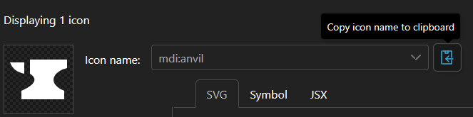

# Quarts Leaflet Map Plugin

Adds a custom leaflet map implementation for [Quartz](https://github.com/jackyzha0/quartz) built websites.

## How to add it to your quartz

- Add file `leafletMapPlugin.ts` to your `quartz\plugins\transformers\`
- Append line `export { LeafletMap } from "./leafletMapPlugin"` to your `quartz\plugins\transformers\index.ts`
- Place line `Plugin.LeafletMap(),` to your `quartz.config.ts` in the end of `plugins: { transformers:` section

## How to use

### How to add a map to a note

Adding a map to a note is done by adding the following block of code to where you want the map to appear.

```md
> [!map|minZoom:-0.5-maxZoom:2-zoomStep:0.5] MAP_NAME
> ![[IMAGE.PNG]]
```

- `MAP_NAME` can be replaced by how you'd like to call your map. You should remember this value as we'll need it to add markers to you map later on. The map name does not need to be unique, but be sure the images are either identical or compatible for marker placement.
- `IMAGE.PNG` can be any image supported by Quartz
- `minZoom`, `maxZoom` are optional boundaries on how much you'll be able to zoom the map. Depending on your map image you might need to fiddle with these, or remove them altogether since they are optional. These values are allowed to be decimal numbers and can be negative.
- `zoomStep` is an optional value that allows the user to control how granular zooming is. This value is allowed to be a decimal number.

### How to add a marker to a map

Adding a marker to a map is done by adding the following block of code to the note you'd want the marker to link to.

```yaml
marker:
  - mapName: MAP_NAME
    x: 100
    y: 55
    icon: ICON
    colour: COLOUR
```

- `MAP_NAME` is the identifier for the map we named earlier. So set it to the value of the map you'd like to add this marker to.
- `x` and `y` are the coordinates on the map the marker needs to be placed. This might require some fiddling to get right.
- The `ICON` and `COLOUR` options are explained below.

#### Marker icons

This plugin makes use of [Iconify](https://iconify.design/) for its markers, this gives you a enormous free range of vector icons to pick from. To show you how to pick an icon I'm going to walk you through an example.

I like the [Material Design Icons](https://icon-sets.iconify.design/mdi/) set and I am looking for a icon to represent a smithy for my fantasy world. By searching through the icons I found the following anvil



You can just click the copy icon to receive the icon name, `mdi:anvil` in this case. `mdi` tells Iconify which set to look in and `anvil` is the icon within that set. We need the full icon name.

#### Marker colours

This plugin uses 10 predefined colours, but also allows for custom colours to be used.

The predefined colours are:
|Colour|Hex|
|------|---|
|green| #039c4b |
|lime| #66d313 |
|yellow| #e2c505 |
|pink| #ff0984 |
|blue| #21409a |
|lightblue| #04adff |
|brown| #e48873 |
|orange| #f16623 |
|red| #f44546 |
|purple| #7623a5 |

The custom colours have to be 3- or 6-digit hex colours, however due to the frontmatter being written in yaml we'll have to omit the `#`.

In short; `red`, `ff4444`, and `f44` are all valid options for roughly the same colour.

#### Multiple markers from a single note

It is possible to add multiple markers from a single note. In this case you'll have to append to the list in the frontmatter. These markers can be added to the same map or to different maps.

```yaml
marker:
  - mapName: map
    x: 100
    y: 55
    icon: mdi:anvil
    colour: red
  - mapName: map
    x: 150
    y: 55
    icon: mdi:alien
    colour: 4f4
```

## Credits

- [Quartz](https://github.com/jackyzha0/quartz) for which this plugin is for.
- [Iconify](https://iconify.design/) for the API this plugin uses to load its icons.
- [Leaflet](https://github.com/Leaflet/Leaflet) which makes the whole plugin even possible.
